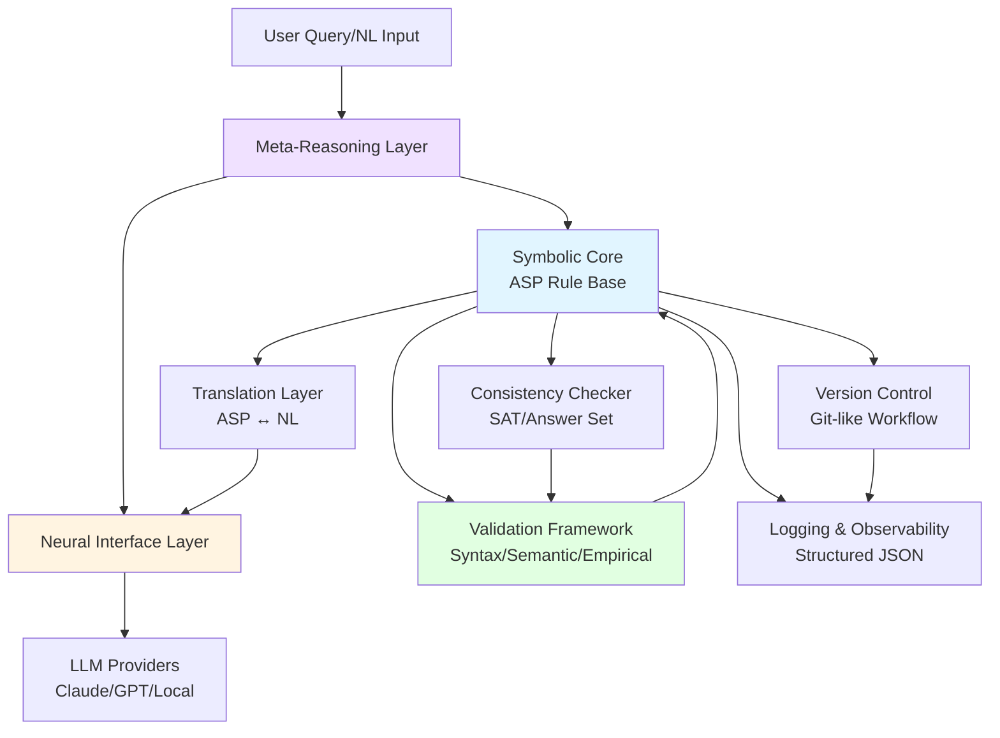
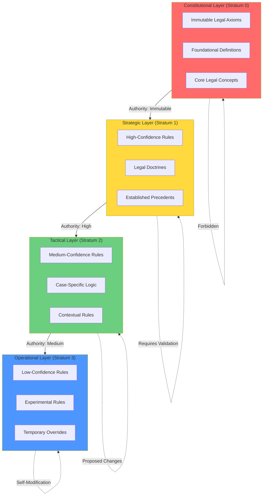
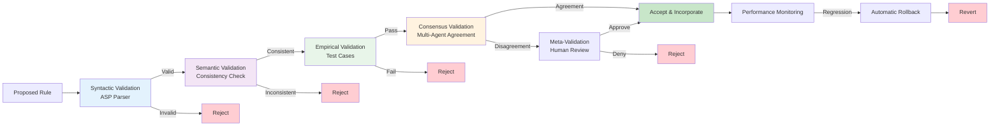
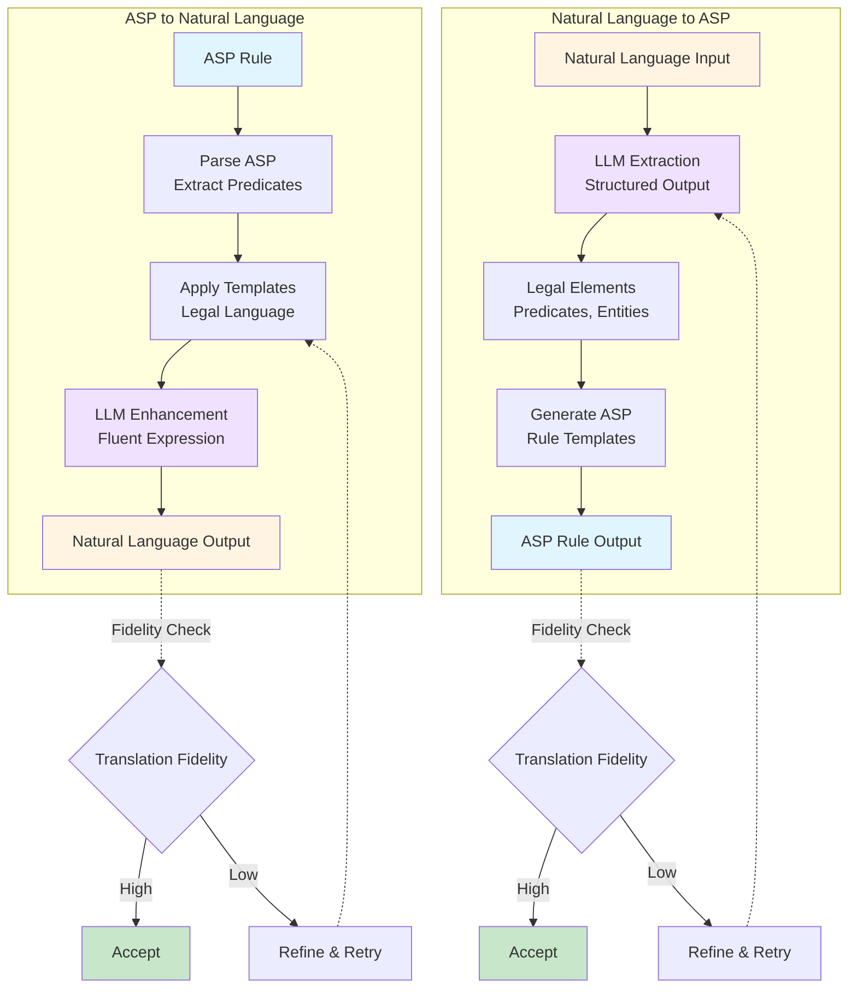
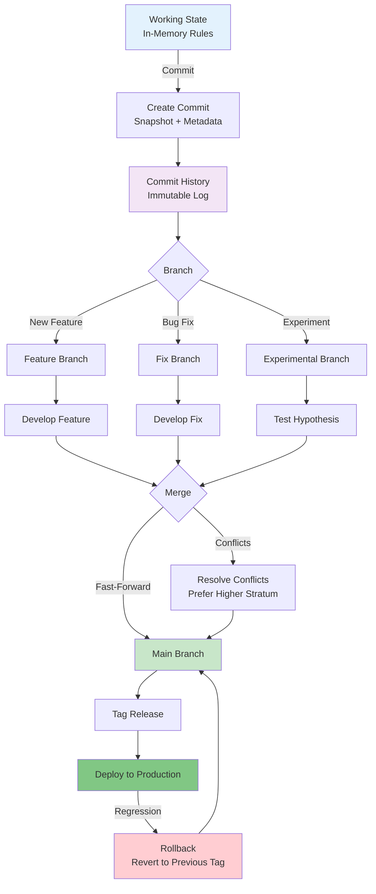
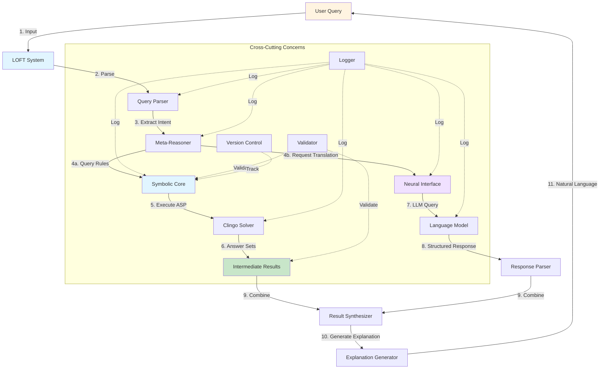
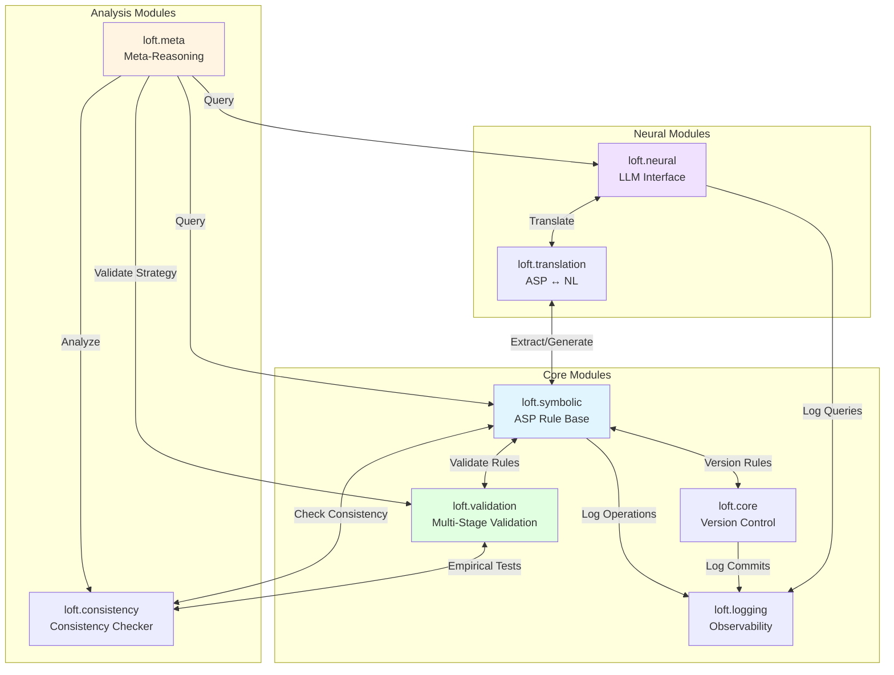

# LOFT System Architecture Overview

This document provides comprehensive architecture diagrams and explanations for the LOFT (Logical Ontological Framework Translator) neuro-symbolic AI system.

## 1. System Architecture Overview

**Key Components:**

- **Meta-Reasoning Layer**: High-level decision making and strategy selection
- **Symbolic Core**: Stratified ASP rule base (Constitutional → Strategic → Tactical → Operational)
- **Neural Interface**: LLM integration with structured I/O
- **Translation Layer**: Bidirectional ASP ↔ Natural Language conversion
- **Validation Framework**: Multi-stage validation pipeline
- **Version Control**: Git-like versioning for rule evolution
- **Consistency Checker**: Ensures logical consistency across rule base
- **Logging**: Comprehensive observability and debugging

## 2. Stratified Core Architecture

**Modification Authority:**

| Layer | Confidence Threshold | Self-Modification | Validation Required |
|-------|---------------------|-------------------|---------------------|
| Constitutional | 1.0 (Immutable) | ❌ Forbidden | N/A |
| Strategic | ≥ 0.90 | ⚠️ Restricted | Rigorous (All stages) |
| Tactical | ≥ 0.75 | ✅ Allowed | Standard (Syntax + Semantic) |
| Operational | ≥ 0.50 | ✅ Encouraged | Lightweight (Syntax only) |

## 3. Validation Pipeline

**Validation Stages:**

1. **Syntactic Validation**: Ensures valid ASP syntax using Clingo parser
2. **Semantic Validation**: Checks logical consistency with existing rules
3. **Empirical Validation**: Tests against curated test cases (ground truth)
4. **Consensus Validation**: Multi-agent debate for agreement
5. **Performance Monitoring**: Tracks accuracy and triggers rollback on regression

## 4. Translation Flow

**Fidelity Checkpoints:**

- **ASP → NL**: Verify natural language preserves logical meaning
- **NL → ASP**: Verify ASP captures all legal elements from text
- **Round-trip**: Test ASP → NL → ASP produces equivalent rule

## 5. Version Control Flow

**Version Control Features:**

- **Commit**: Snapshot of entire rule base with metadata
- **Branch**: Isolated development environments
- **Merge**: Combine branches with automatic conflict resolution
- **Diff**: Compute rule additions, deletions, modifications
- **Tag**: Mark stable releases
- **Rollback**: Revert to any previous state

## 6. Data Flow Diagram

**Data Flow Steps:**

1. User submits natural language query
2. System parses query to extract legal question
3. Meta-reasoner determines reasoning strategy
4. Query symbolic core (ASP) and/or neural interface (LLM)
5. Execute ASP program with Clingo solver
6. Retrieve answer sets (legal conclusions)
7. Query LLM for translation/explanation
8. Parse structured LLM response
9. Synthesize symbolic and neural results
10. Generate human-readable explanation
11. Return natural language response

**Cross-Cutting Concerns:**

- **Logging**: All steps logged with structured JSON
- **Validation**: Rules and results validated at each stage
- **Version Control**: Rule modifications tracked

## 7. Module Interactions

**Key Integration Points:**

- **Symbolic ↔ Validation**: All rule modifications validated
- **Symbolic ↔ Version Control**: Every change committed to history
- **Symbolic ↔ Consistency**: Periodic consistency checks
- **Translation ↔ Neural**: ASP ↔ NL conversion via LLMs
- **Meta ↔ All**: Meta-reasoning coordinates all components
- **Logging → All**: Universal observability

## Architecture Principles

### 1. Separation of Concerns
- **Symbolic reasoning** (ASP) separate from **neural reasoning** (LLMs)
- Clear boundaries between validation, versioning, and core logic

### 2. Stratification
- Rules organized by confidence and modifiability
- Higher strata constrain lower strata

### 3. Validation Gates
- No rule enters system without passing validation pipeline
- Automatic rollback on performance regression

### 4. Observability First
- Comprehensive logging at all decision points
- Structured JSON for machine-readable analysis

### 5. Immutable History
- Version control preserves all changes
- Easy rollback to any previous state

### 6. Fail-Safe Defaults
- Conservative validation thresholds
- Constitutional layer cannot be modified
- Automatic rollback beats manual intervention

## Performance Characteristics

| Component | Typical Latency | Scalability | Bottleneck |
|-----------|----------------|-------------|------------|
| ASP Solver | 10-100ms | 1000s of rules | Grounding phase |
| LLM Query | 1-5s | Token limit | API rate limits |
| Validation | 100-500ms | Test suite size | Empirical tests |
| Version Control | <10ms | Commit history | Diff computation |
| Consistency Check | 50-200ms | Rule count | SAT solving |

## Future Architecture Evolution

See [MAINTAINABILITY.md](../MAINTAINABILITY.md) for planned enhancements:

- **Phase 1.5**: LinkedASP integration for queryable documentation
- **Phase 2**: Advanced validation and consensus mechanisms
- **Phase 3**: Self-modifying system with autonomous improvement
- **Phase 4**: Distributed deployment and collaborative reasoning

---

**Last Updated**: 2025-11-27
**Maintained By**: LOFT Development Team
